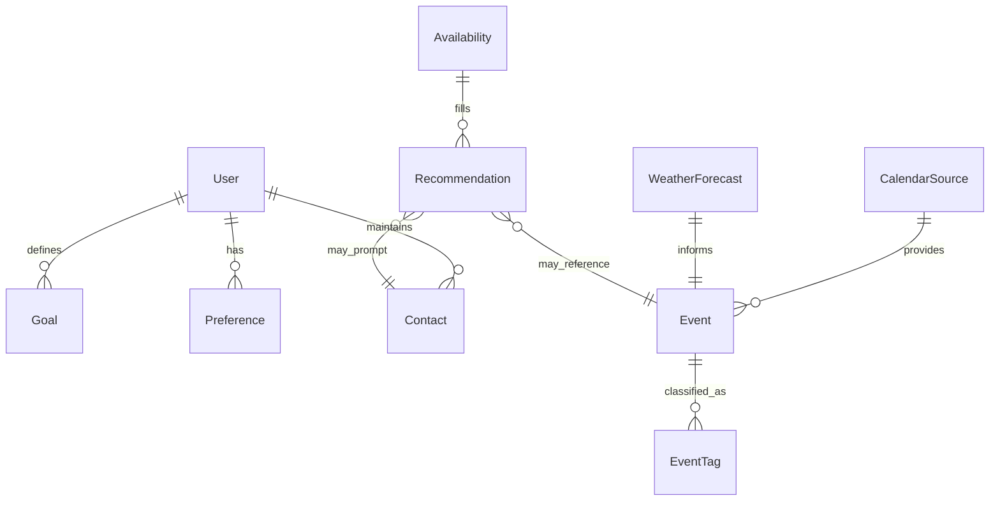

# Spiceflow Social

Spiceflow Social will be a personal planning assistant that helps fill evening time with meaningful activities across the next 30 days. The application will combine data from curated event calendars, intentional relationship lists, personal goals, weather forecasts, and Google Calendar availability to propose balanced suggestions for each open evening block.

This master plan outlines the desired capabilities, data inputs, decision logic, and phased roadmap for building the repository.

## Zero-API pipeline (2025 refresh)

The previous scaffold-only prototype now lives in `archive/zero-api-scaffold/` for reference. Use the modules under `src/` for the active pipeline.

The repository now includes an end-to-end, zero-OAuth workflow that gathers public events, scores them against your goals, and
produces an `ICS` you can import into Apple Calendar (which syncs upstream to Google). The components live under `src/`:

| Stage | Module | Purpose |
| --- | --- | --- |
| Scrape | `src/scrape/*` | Pull events via ICS, JSON-LD, or HTML selectors with optional JS fallback. |
| Emit | `src/emit/*` | Write per-source artifacts, merged calendars, and run reports. |
| Plan | `src/plan/*` | Score events and choose the monthly portfolio subject to quiet hours and weekly caps. |
| Run | `src/run_all.py` | Orchestrate the full pipeline and drop outputs into `data/out/`. |

Quick start:

```bash
python -m venv .venv
source .venv/bin/activate
pip install -r requirements.txt  # or `pip install -e .`
python src/run_all.py --horizon-days 45
```

Outputs are stored in `data/`:

* `data/events_batches/batch_YYYY-MM-DD/` — per-source JSONL, ICS, and run report.
* `data/merged/` — deduped combined feed.
* `data/out/winners.ics` — import into Apple Calendar and target your Google calendar.
* `data/out/winners-REMOVE.ics` — rollback file (STATUS:CANCELLED) if you need to retract a run.

Tune `src/sources.yaml` to add/remove feeds and `src/scoring_config.json` to tweak your weighting for career, social, wellbeing,
and outdoors priorities.

- **Calendar sandbox:** Create a dedicated Apple/Google calendar (e.g., `Ann Arbor Events & Activities` configured in `src/preferences.yaml`) and import only the generated `winners.ics` into that calendar.

## Vision & Objectives

* **Holistic evening planning** – Suggest the best use of every open 6–10 PM slot over the coming month.
* **Goal alignment** – Prioritize activities that progress clearly defined personal and professional goals.
* **Preference awareness** – Respect entertainment, intellectual, social, and wellness preferences when evaluating options.
* **Balanced wellbeing** – Avoid overscheduling intensive fitness or mentally demanding events without adequate recovery.
* **Context sensitivity** – Account for logistics, weather conditions, and existing commitments to avoid conflicts.

## Key Inputs

| Category | Source | Notes |
| --- | --- | --- |
| Event calendars | Chrome bookmark folder pointing to ~30 public calendars | Need bookmark import/management strategy; each calendar likely iCal/ICS or HTML feeds. |
| Goals & preference doc | Markdown/structured document stored in repo | Describes goals, activity preferences, desired outcomes, constraints. |
| Relationship list | Document/CSV of people to intentionally contact | Used to suggest "reach out" instead of an event when appropriate. |
| Google Calendar | Google Calendar API (OAuth) | Read-only access to determine busy vs. free slots between 6–10 PM. |
| Weather | Weather API (e.g., OpenWeather, National Weather Service) | Provide forecasts for outdoor suitability. |
| Location profile | Home/typical base location, travel constraints | Used to filter events by travel time and compatibility with existing commitments. |

## Core Capabilities

1. **Calendar ingestion**
   * Parse bookmark folder export to locate 30 event calendar URLs.
   * Normalize event data (title, start/end, location, tags) into unified schema.
2. **Goals & preferences parsing**
   * Read structured document describing goals, entertainment vs. intellectual needs, divergent vs. convergent modes, social intent, wellbeing targets, and professional development objectives.
   * Extract scoring weights and constraints (e.g., max heavy strength sessions per week).
3. **Relationship suggestion engine**
   * Maintain list of priority contacts with desired cadence.
   * Recommend outreach during free evenings when no fitting events exist.
4. **Availability detection**
   * Authenticate with Google Calendar and fetch events for next 30 days.
   * Identify open blocks between 6 PM and 10 PM.
5. **Weather-aware filtering**
   * Pull 30-day forecast (hourly/daily granularity as available).
   * Block outdoor events when inclement weather (rain, extreme cold) is predicted.
6. **Conflict-aware recommendations**
   * Evaluate location feasibility vs. surrounding commitments.
   * Avoid suggesting intense fitness sessions on consecutive days if conflicting with goals.
   * Balance suggestions across goal categories over the planning horizon.
7. **Output generation**
   * Produce daily or weekly recommendation reports (Markdown, email, or dashboard).
   * Include rationale referencing goals, preferences, and constraints.

## Decision Logic Overview

1. For each date in the next 30 days, extract 6–10 PM availability window from Google Calendar.
2. If no free slots, mark day as "scheduled" and store existing commitments.
3. If free slots exist:
   * Filter candidate events by date, time overlap, location feasibility, and weather.
   * Score candidates using weighted criteria derived from goals/preferences:
     * Entertainment vs. intellectual stimulation needs.
     * Divergent (exploratory) vs. convergent (goal-focused) desires.
     * Social connection priorities (e.g., meeting new people, deepening relationships).
     * Fitness targets (cardio, strength, recovery spacing).
     * Professional advancement opportunities.
   * Enforce constraints (e.g., cap strength workouts, ensure variety across week).
4. When no event meets thresholds, consider relationship outreach suggestions weighted by cadence and compatibility with goals.
5. Output the top suggestion per free evening with justification, recommended preparation, and backup options.

## Data Model Sketch



* `Goal`: description, category (fitness, professional, social, etc.), priority weight.
* `Preference`: structured rules (e.g., desired entertainment vs. intellectual balance).
* `Event`: normalized fields plus derived attributes (intensity level, travel time).
* `Recommendation`: stores final suggestion, reasoning, and confidence.

## Integration Considerations

* **Chrome bookmark ingestion** – Export bookmarks to JSON; parse folder to collect calendar URLs; support manual refresh cadence.
* **Calendar formats** – Standardize ICS feeds or use scraping adapters for HTML calendars without feeds.
* **Authentication** – Google OAuth consent screen for calendar access; store tokens securely.
* **Weather** – Choose API with reliable hourly forecasts; consider caching to minimize calls.
* **Location handling** – Leverage geocoding APIs to convert event addresses to coordinates; compute travel time via Google Maps or OpenRouteService.
* **Scheduling intelligence** – Use rule engine or constraint solver to avoid conflicting goals (e.g., repeated heavy workouts).

## Phased Roadmap

1. **Foundation & Data Structures**
   * Scaffold repo (Poetry/virtualenv, linting, testing).
   * Define configuration files for credentials and personal documents.
   * Draft schemas for events, goals, preferences, contacts, and recommendations.
2. **Calendar & Availability Ingestion**
   * Implement bookmark parser and calendar fetchers.
   * Connect to Google Calendar API for free/busy lookup within 6–10 PM window.
   * Store availability timeline for next 30 days.
3. **Goals & Preference Engine**
   * Convert personal goals document into structured format (YAML/JSON).
   * Build scoring weight calculators and constraint definitions.
4. **Recommendation Engine MVP**
   * Combine events, preferences, and availability to produce ranked suggestions.
   * Implement simple weather filtering and location distance checks.
5. **Wellbeing & Weather Enhancements**
   * Add fatigue/overuse guardrails for fitness suggestions.
   * Integrate richer weather rules (precipitation, temperature thresholds).
   * Introduce alternative recommendations (relationship outreach, at-home activities).
6. **Output & Feedback Loop**
   * Generate recommendation reports (Markdown + optional email).
   * Capture user feedback to refine scoring weights.
7. **Automation & Monitoring**
   * Schedule nightly run to refresh 30-day plan.
   * Add logging, error alerting, and audit trails for suggestions.

## Repository Structure (Planned)

```
spiceflow-social/
├── README.md                # Master plan (this document)
├── docs/
│   ├── goals_preferences.md # Source document with goals & preferences
│   ├── data_model.md        # Expanded schemas and ERD details
│   └── api_integrations.md  # OAuth and API setup guides
├── data/
│   ├── bookmarks.json       # Chrome bookmark export (git-ignored)
│   ├── contacts.yaml        # Intentional relationship list (git-ignored)
│   └── goals.yaml           # Structured goals (git-ignored)
├── src/
│   ├── ingestion/           # Calendar, weather, contact ingestion modules
│   ├── scheduling/          # Availability logic and recommendation engine
│   ├── scoring/             # Goal alignment and constraint evaluators
│   └── outputs/             # Report generation modules
└── tests/                   # Unit and integration tests
```

Sensitive files (credentials, personal lists) should remain outside version control and referenced through environment variables or encrypted storage.

## Security & Privacy Notes

* Store OAuth tokens securely (e.g., `keyring`, encrypted secrets file).
* Avoid committing personal data; use `.gitignore` for documents containing contacts and goals.
* Consider anonymized logging for recommendation rationales.
* Implement permission boundaries if sharing repo (e.g., separate config repo with encrypted data).

## Next Steps

1. Finalize the goals/preferences document structure and convert to machine-readable format.
2. Gather the list of event calendar URLs and verify access methods (ICS vs. HTML).
3. Set up Google Cloud project for Calendar API credentials and configure OAuth flow.
4. Choose weather API provider and obtain API keys.
5. Begin implementing ingestion pipelines and baseline recommendation heuristics.

This plan provides the foundation for the Spiceflow Social repository. Subsequent commits can follow the phased roadmap to deliver a personal evening planning assistant that balances entertainment, growth, social connection, and wellbeing.
